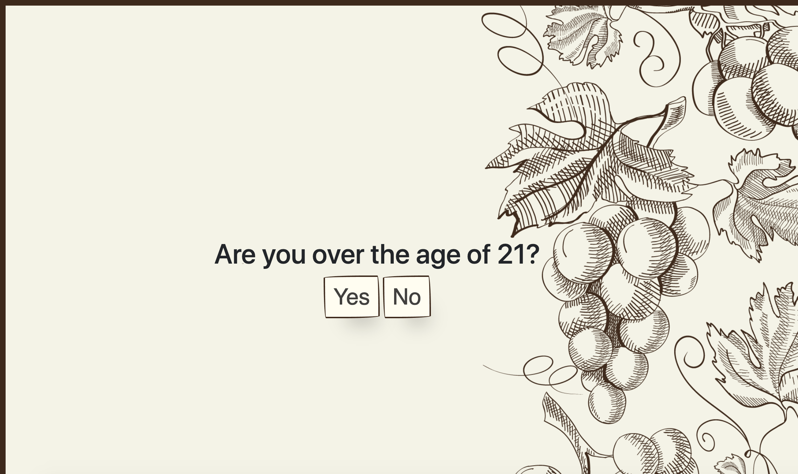
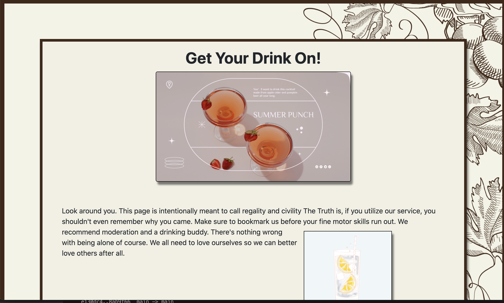
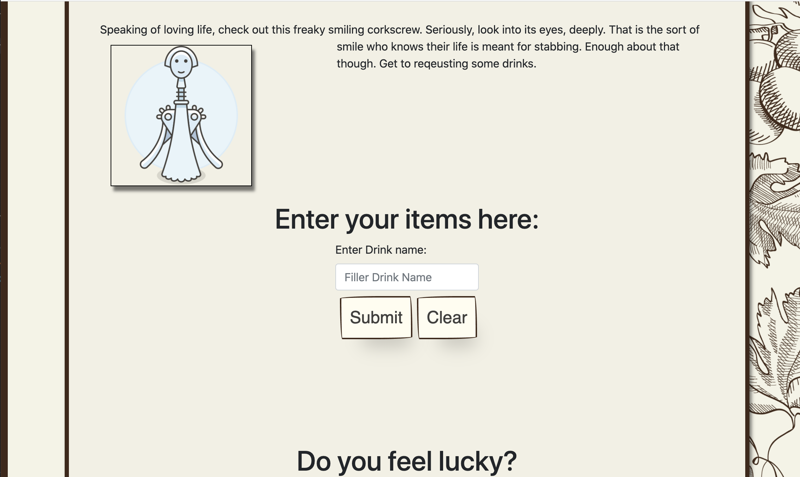
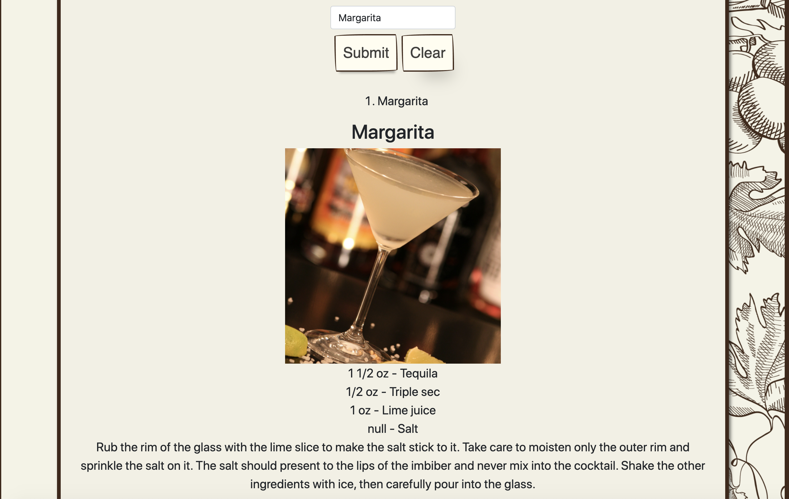
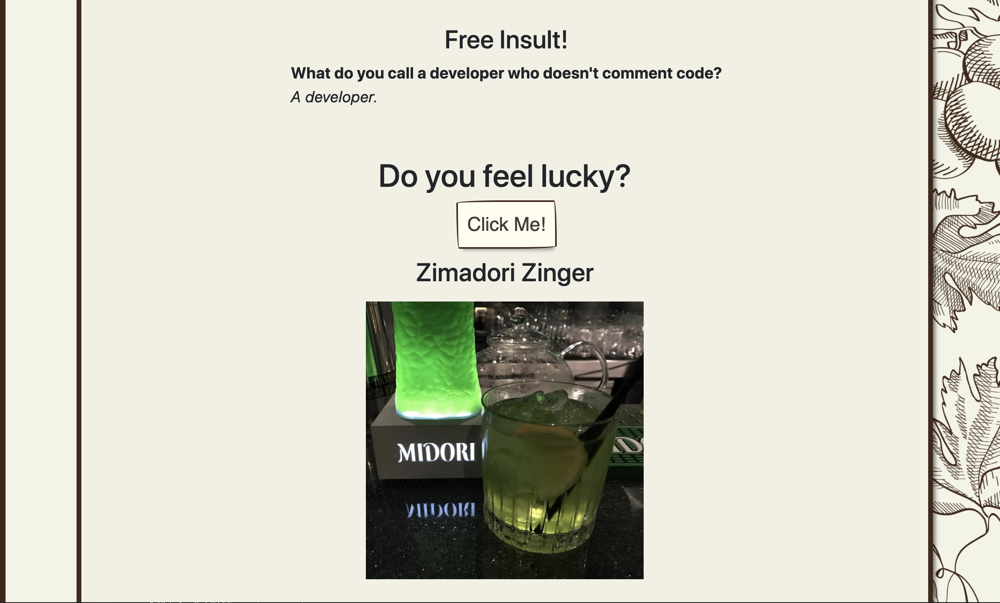
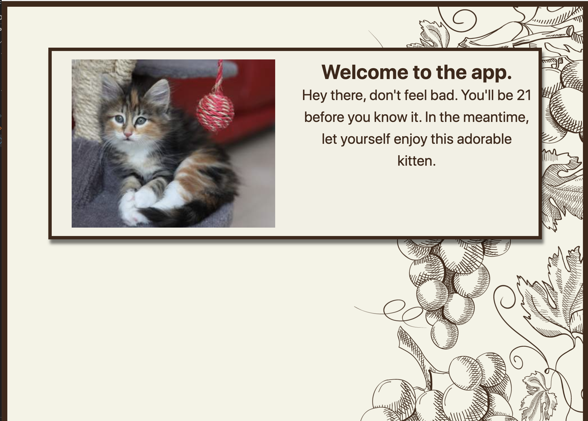

# Title / Summer Punch (Project_1)

## About / User Story

* AS A User
* I WANT an initial page that requires a confirmation of age
* So THAT I can ensure the facade of safety keeping under/21's out of the site. 
* I WANT to select cocktails by name
* SO THAT I can ensure proper ingredients and mixing instructions to avoid embarrassment at parties
* I WANT a random cocktail mix button
* SO THAT I can avoid the process of thinking about what I want to drink

## Acceptance Criteria
  
* GIVEN A dashboard with inputs for drinks, random drink button call
* WHEN I search for a drink
* THEN I am presented with the drink name and ingredient list
* WHEN I don't care about what kind of drink I want
* THEN Let me see a random drink 
* WHEN I select either choice
* THEN I want to see a joke or insult with each click
* WHEN I enter the web-page URL 
* THEN I am taken to an age confirmation modal
* WHEN I select Yes
* THEN I am taken to the dashboard for drinks and insults
* WHEN I select NO I am taken to a safe page for those under 21

## Table of contents

> * [Title / Repository Name](#title--repository-name)
>   * [About / Synopsis](#about--synopsis)
>   * [Acceptance Criteria](#acceptance-criteria)
>   * [Table of contents](#table-of-contents)
>   * [Installation](#installation)
>   * [Usage](#usage)
>     * [Screenshots](#screenshots)
>     * [Features](#features)
>   * [Code](#code)
>     * [Content](#content)
>     * [Requirements](#requirements)
>     * [Limitations](#limitations)
>     * [Build](#build)
>     * [Deploy (deploy)](#deploy)
>   * [Resources (Documentation)](#resources-documentation)
>   * [Contributing / Reporting issues](#contributing--reporting-issues)
>   * [License](#license)
>   * [About Us](#about-us)

## Installation

Just select the Deploy link down below, don't waste time here. 

## Usage

* Creative Commons
* Fair Use
* Don't monetize this, seriously, things are expensive enough. 

### Screenshots
 
 
 
 
 
 

### Features

> * It can help you determine what sort of drink you would like randomly
> * Or you can name your drink 
>  *And get images of the drink, names of the drink, ingredients of the drink, and how to mix the drink

## Code

Built with HTML, CSS, Javascript

### Content

This is a webpage designed by adults for adults who do adulting things with drinks and jokes. 

### Requirements

No Requirements other than being over 21 to get past the front page, and a working touchscreen/mouse. 

### Limitations

There are only so many drinks currently known in the database. It is a practice that has ever new inventive drink formulations so bear with us as it may be out of date at time of publication. Same with jokes and insults. Often times though with new drinks come new insults due to inhibitions being lowered. 

### Build / Repo

    v.1
> * https://github.com/Lemming97/Project_1

### Deployment Page

> * https://lemming97.github.io/Project_1/

## Resources (Documentation)

> * <a href="https://v2.jokeapi.dev/">Joke</a> (api)
> * <a href="https://www.thecocktaildb.com">CocktailDB</a> (api)
> * <a href="https://placekitten.com/">Placekitten</a> (api)
> * <a href="https://getbootstrap.com/docs/5.1/getting-started/introduction/">Bootstrap</a> (css)
> * <a href="https://fonts.google.com/">Google Fonts</a> (css)

## Contributing / Reporting issues

> * [Link to github] https://github.com/Lemming97/Project_1
> * [Link to project] https://lemming97.github.io/Project_1/
> 

## License

> * CC

## About Us 

* Lindsey Martin (Captain of Cocktails) 
* Mark Taylor (First-Mate Mixologist )
* Noreen Arshad (Lido Deck Liaison)
* Get to the well and get drinking! (in moderation)
 

